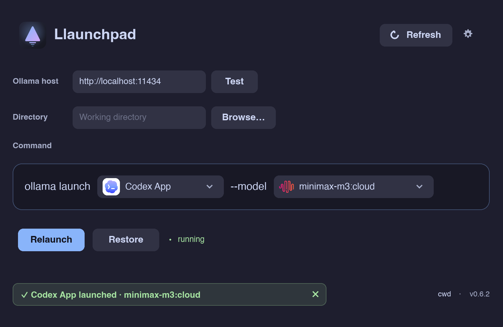

<p align="center">
  
</p>

<p align="center">
  <a href="https://github.com/draugvar/llaunchpad/stargazers"></a>
  <a href="LICENSE"></a>
  
  
</p>

<p align="center">
  <b>A native, cross-platform launcher that wires any Ollama coding agent to any cloud model — in one click.</b>
</p>

---

## What is this?

[Ollama](https://ollama.com) ships `ollama launch <agent> --model <model>` to point coding
agents (Codex, Claude Code, Cursor, …) at models you run locally or in the
[Ollama Cloud](https://ollama.com/cloud). Doing it by hand means remembering agent tokens,
the exact cloud model names, and re-typing the command every time.

**Llaunchpad** is a tiny, good-looking GUI around that command:

- 🧩 **Pick an agent** from a dropdown — populated live from `ollama launch --help`.
- ☁️ **Pick a cloud model** from a dropdown — the full Ollama Cloud catalog, fetched in the background.
- 🚀 **One click** builds and runs `ollama launch <agent> --model <model>` for you.
- 🔁 Already running? It **closes and relaunches** the app cleanly.
- 💾 Remembers your **last selection** between runs.

<p align="center">
  
</p>

## Features

| | |
|---|---|
| **Live agent list** | Parsed from `ollama launch --help` — always in sync with your Ollama version. |
| **Full cloud catalog** | Every model from `ollama.com/v1/models`, refreshed in the background every 5s. |
| **Custom Ollama host** | Point at any local or remote Ollama server; **Test** button probes the URL and pulls its local models. |
| **Local model badge** | Local models from your server show up first in the dropdown, tagged with a teal **local** badge. |
| **Correct model names** | Cloud ids are auto-normalized to launchable refs (`glm-4.6` → `glm-4.6:cloud`, `gpt-oss:120b` → `gpt-oss:120b-cloud`). |
| **GUI & CLI agents** | GUI apps (Codex, VS Code) are opened/relaunched; CLI agents spawn in Terminal. |
| **Codex App fix** | Strips the legacy `profile =` line modern Codex rejects, so launches just work. |
| **One-click restore** | Restore button reverts an agent to its original profile when Ollama has a backup; disabled otherwise. |
| **Smart "running" badge** | Detects the real GUI process by bundle path — no false positives from background helpers. |
| **Persisted state** | Your last agent + model are restored on the next launch. |
| **Native & light** | Pure Rust + [Slint](https://slint.dev), single ~14 MB binary, no Electron. |
| **Cross-platform** | Runs on macOS, Linux, and Windows. |

## Install

### Prerequisites
- macOS 11+, Linux, or Windows
- [Ollama](https://ollama.com/download) installed and signed in (`ollama signin`) for cloud models.

### Homebrew (macOS, recommended)
```bash
brew install --cask draugvar/llaunchpad/llaunchpad
```
Homebrew strips the quarantine flag, so the app opens normally — no right-click dance.

### Download (all platforms)
From the [Releases](https://github.com/draugvar/llaunchpad/releases) page:

- **macOS** — `llaunchpad-macos-universal.tar.gz` → unzip → move `Llaunchpad.app` to `/Applications`.
  (Direct download isn't notarized; first launch needs right-click → **Open**. Homebrew avoids this.)
- **Linux** — `llaunchpad-linux-x86_64.tar.gz` → extract → run `./llaunchpad`.
- **Windows** — `llaunchpad-windows-x86_64.zip` → extract → run `llaunchpad.exe`.

Ollama must be installed and on your PATH (or in a standard location) on every platform.

### Build from source
```bash
git clone https://github.com/draugvar/llaunchpad.git
cd llaunchpad
cargo build --release
./bundle.sh            # produces Llaunchpad.app
open Llaunchpad.app
```

## Usage

1. Open Llaunchpad.
2. (Optional) Paste your **Ollama host** URL (default `http://localhost:11434`) and hit
   **Test** to pull that server's local models into the dropdown.
3. Choose an **agent** and a **model** from the inline dropdowns.
4. Hit **Launch**. The status bar confirms what was started. Click the ✕ to dismiss it.

That's it — Llaunchpad runs `ollama launch <agent> --model <model> -y` under the hood and
brings the agent up configured against your chosen model.

## How it works

```
┌─────────────┐   ollama launch --help   ┌──────────────┐
│   agents    │ ◀──────────────────────  │              │
├─────────────┤                          │  Llaunchpad  │
│   models    │ ◀── ollama.com/v1/models │   (Rust +    │
└─────────────┘                          │    Slint)    │
        │  ollama launch <agent>         │              │
        └──── --model <model> -y ──────▶ └──────────────┘
```

- **Agents** come from the *Supported integrations* block of `ollama launch --help`.
- **Models** come from the Ollama Cloud catalog and are normalized to runnable refs.
- **Launching** spawns `ollama launch`; for GUI agents the running app is quit first, then reopened.

## Supported agents

`claude` · `codex-app` · `codex` · `vscode` · `cursor` · `opencode` · `copilot` · `droid` ·
`kimi` · `cline` · `hermes` · `openclaw` · `pi` · `pool`

*(whatever your installed `ollama` reports — the list is dynamic.)*

> ⚠️ Not every cloud model supports agentic tool-calling. For coding agents prefer
> `qwen3-coder`, `deepseek`, `glm-*`, `kimi-k2*`, `gpt-oss`, `minimax-m2*`. Small/preview/vision
> models may return `Invalid tool type`.

## Development

```bash
cargo run                 # debug run
cargo test                # unit tests (agent parsing, model naming)
cargo build --release && ./bundle.sh
```

Project layout:
```
src/
  main.rs            UI wiring, background refresh, state persistence
  config.rs          last-used selection + ollama_host (prefs.json)
  ollama/
    agents.rs        parse `ollama launch --help`
    models.rs        cloud catalog + local /api/tags + server probe
    launch.rs        spawn / quit / relaunch, Codex config fix
ui/app.slint         Slint UI + theme
assets/              icon, banner, screenshot
bundle.sh            assemble Llaunchpad.app
```

## Contributing

Issues and PRs welcome. Good first contributions: more agent ⇄ process mappings,
Linux/Windows support, a model capability filter.

## License

MIT © [draugvar](https://github.com/draugvar) — see [LICENSE](LICENSE).

<sub>Not affiliated with Ollama. Built with ❤️ and a lot of `cargo build`.</sub>
